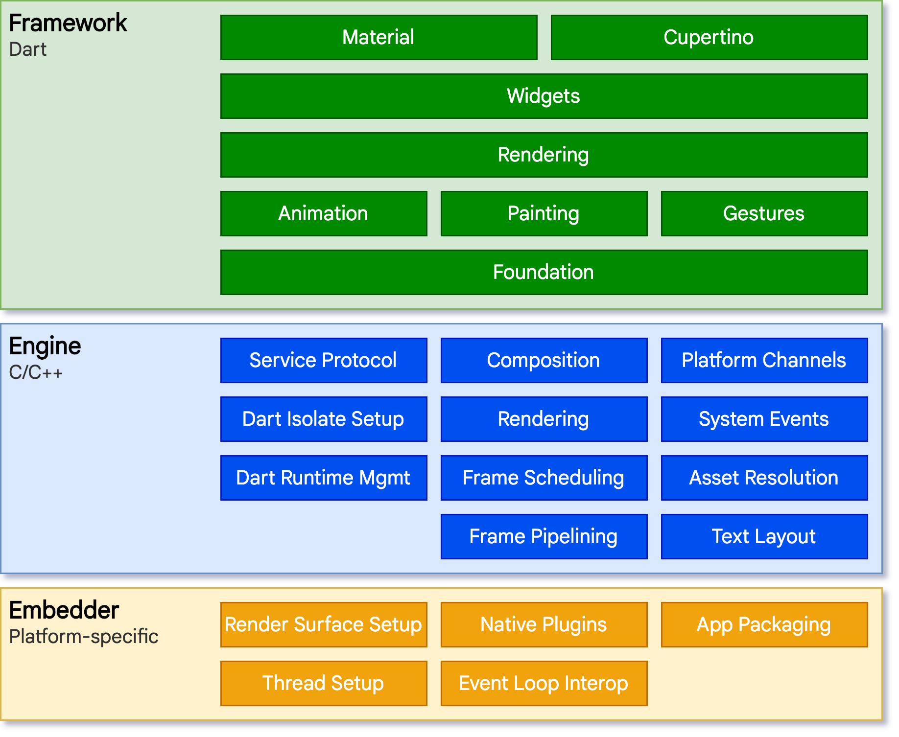

# FLutter

## Architectural layers

Flutter builds apps using the native platform UI components.

## Widget

\- The basic building block of a UI(user interface)

\- Dart class

To turn a class into a widget,
extend from one of **the core Widget classes** like `StatelessWidget`

### build

Build Method renders the Widget on the screen

### StatelessWidget

Simplest Widget, it just renders **UI**

##

The root of a Flutter application has to be either a `MaterialApp` or a `CupertinoApp`

=> Materialapp이 훨씬 보기 좋음

### Scaffold

The root Widget for all of our screens
